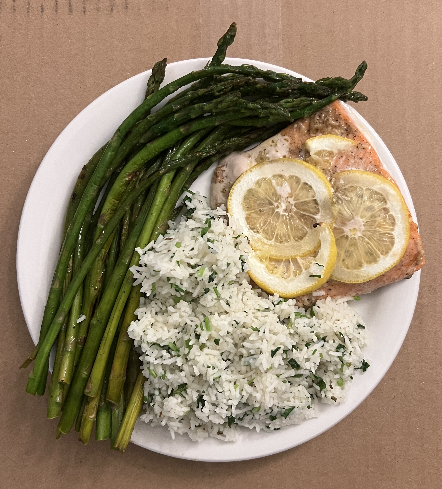
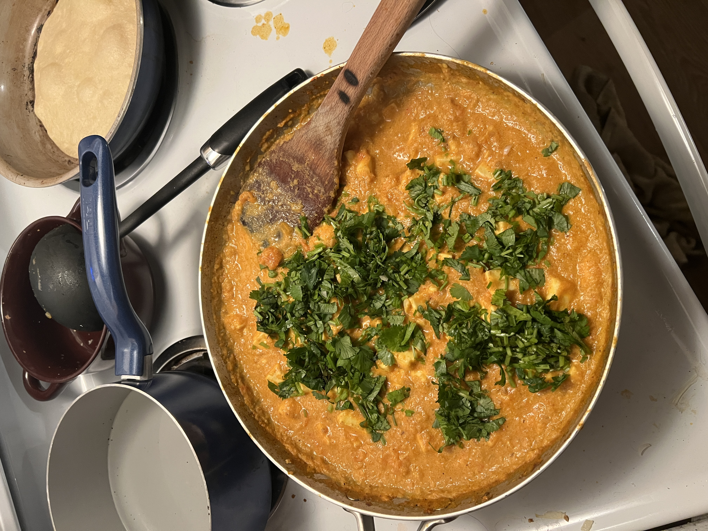

<!DOCTYPE html>
<html lang="en">
  <head>
    <meta charset="UTF-8" />
    <meta http-equiv="X-UA-Compatible" content="IE=edge" />
    <meta name="viewport" content="width=device-width, initial-scale=1.0" />
    <title>Atharva Kulkarni</title>
    <link rel="icon" href="./images/pic_smooth.png" />
    <link rel="preconnect" href="https://fonts.googleapis.com" />
    <link rel="preconnect" href="https://fonts.gstatic.com" crossorigin />
    <link
      href="https://fonts.googleapis.com/css2?family=Roboto:wght@300;900&display=swap"
      rel="stylesheet"
    />
    <link rel="stylesheet" href="./css/cooking.css" />
  </head>
  <body>
    

        <h2><a href="./">About Me</a></h2>
        <h2><a href="./projects.html">Projects</a></h2>
        <h2><a href="./cooking.html">Cooking!</a></h2>
    

    <main>
        <h1>
            I like to cook!
        </h1>
        <!-- <h3>This is food I make.</h3> -->

        

          

            <li class="project-wrapper">
              

                <h4 class="project-title">lemon butter garlic salmon</h4>
                

                  Wild caught Alaskan Salmon with asparagus (stir fried with coconut oil)
                  and a side of cilantro rice. I like to make this on week-nights because
                  its easy to make and packed with protein.
                

              </a
              >
            </li>

            <li class="project-wrapper">
              

                <h4 class="project-title">pasta w/homemade green sauce + falafel</h4>
                

                  Pasta with creamy high protein green sauce and side of falafel.
                

              </a
              >
            </li>

            <li class="project-wrapper">
              

                <h4 class="project-title">?? curry</h4>
                

                  Paneer or tofu curry (I forgot lol) with roti.
                

              </a
              >
            </li>

            <li class="project-wrapper">
              

                <h4 class="project-title">Tofu noodle soup</h4>
                

                  Lightly sautéed tofu with rice noodles and a chicken bone
                  broth base soup.
                

              </a
              >
            </li>
    </main>
        
  </body>
</html>
